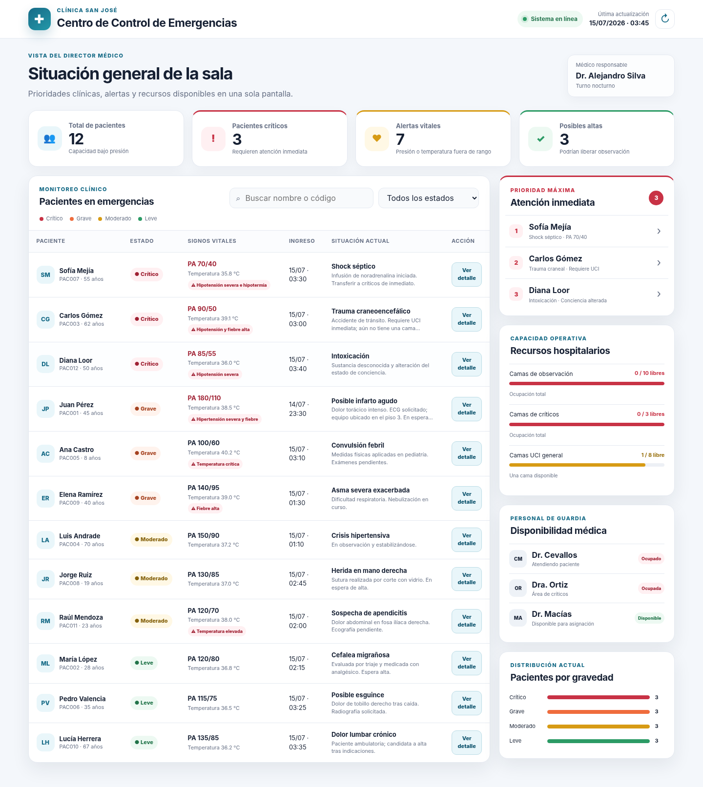

# 🏥 Dashboard de Emergencias Médicas — Clínica San José



## 📌 Descripción del proyecto

Este proyecto presenta el rediseño digital del reporte de emergencias de la **Clínica San José**. El sistema anterior mostraba toda la información en un bloque de texto plano, lo que dificultaba identificar pacientes críticos, alertas clínicas y disponibilidad de recursos.

La propuesta consiste en un **dashboard web interactivo y responsive**, desarrollado con HTML, CSS y JavaScript, orientado al Dr. Alejandro Silva para facilitar la toma de decisiones rápidas en la sala de emergencias.

> **Actividad:** Rediseño de Salidas Efectivas – Dashboard de Emergencias

> **Integrantes:** _[Juan Pablo Rovayo Delgado]_

---

##  Objetivo

Transformar un reporte saturado y poco legible en una salida digital que permita:

- Identificar inmediatamente a los pacientes críticos y graves.
- Detectar signos vitales fuera de los rangos esperados.
- Revisar la disponibilidad de camas y médicos de guardia.
- Localizar posibles altas para liberar camas de observación.
- Filtrar y consultar los datos de cada paciente sin leer todo el reporte.

---

##  Paso 1: Análisis de deficiencias del reporte anterior

### 1. Ausencia de jerarquía visual

El reporte presenta todos los datos con la misma tipografía, tamaño y estructura. Un paciente crítico aparece visualmente igual que uno leve, por lo que el director debe leer línea por línea para reconocer las prioridades. Esto aumenta el tiempo de respuesta y puede provocar que una alerta importante pase desapercibida.

**Solución aplicada:** se utilizaron tarjetas KPI, niveles de gravedad claramente identificados, una sección exclusiva de atención inmediata y una tabla ordenada desde los pacientes críticos hasta los leves.

### 2. Sobrecarga de información y baja legibilidad

Cada registro mezcla código, nombre, edad, estado, presión, temperatura, fecha y comentarios extensos en una sola línea. La falta de separación visual y el uso permanente de mayúsculas producen sobrecarga cognitiva y dificultan la lectura rápida.

**Solución aplicada:** los datos fueron agrupados por categorías. Los indicadores generales, signos vitales, recursos, personal y detalles clínicos se presentan en secciones separadas. Los comentarios extensos se resumen en la tabla y se amplían mediante una ventana de detalle.

### 3. Falta de alertas, interacción y actualización visible

El sistema heredado no resalta automáticamente valores fuera de rango, no permite buscar o filtrar pacientes y tampoco muestra de forma clara cuándo se actualizó la información. El usuario depende de revisar manualmente todo el texto cada vez que recibe un nuevo reporte.

**Solución aplicada:** el dashboard incluye alertas visuales acompañadas de texto, búsqueda por nombre o código, filtro por gravedad, un botón de actualización, indicador de conexión y detalle interactivo de cada paciente.

---

##  Paso 2: Criterios de selección tecnológica

### 1. ¿Quién recibirá la información?

La información será recibida principalmente por el **Dr. Alejandro Silva**, director médico de la Clínica San José. Debido a su nivel de responsabilidad, necesita primero una visión ejecutiva con indicadores generales y alertas prioritarias. Después debe poder consultar el detalle clínico de cada paciente cuando sea necesario. Por esta razón, el dashboard utiliza una jerarquía que comienza con los KPIs, continúa con los casos urgentes y termina con la tabla detallada.

### 2. ¿Cómo accederá a ella?

El dashboard está pensado para visualizarse desde una computadora de escritorio o laptop ubicada en el centro de control de emergencias. También es responsive para permitir consultas desde una tableta. Al estar desarrollado con tecnologías web, puede ejecutarse en un navegador moderno dentro de la red de la clínica sin requerir una instalación especializada.

### 3. ¿Con qué rapidez se requiere?

La información debe estar disponible **en tiempo real o con actualizaciones de pocos segundos**, porque las condiciones de los pacientes y la disponibilidad de camas pueden cambiar rápidamente. En este prototipo se simula la actualización mediante un botón y un indicador de la última consulta. En una implementación real, el sistema podría consumir datos de una API o utilizar WebSockets para actualizarse automáticamente.

### 4. ¿Qué nivel de interacción requiere?

Se requiere un nivel de interacción medio-alto. El usuario puede buscar pacientes por nombre o código, filtrar por gravedad, abrir una ficha con información ampliada y revisar las prioridades operativas. También se incluyen alertas automáticas y retroalimentación visual después de una acción. En una versión conectada al sistema hospitalario podrían agregarse funciones para asignar médicos, aprobar traslados o registrar altas.

---

##  Paso 3: Justificación teórica y diseño conceptual

### Modelo conceptual: Información — Presentación — Contexto

#### Información: ¿Qué mostrar?

Se priorizaron los datos que influyen directamente en la toma de decisiones:

- Cantidad total de pacientes.
- Número de pacientes críticos.
- Alertas de presión arterial y temperatura.
- Posibles altas médicas.
- Disponibilidad de camas de observación, críticos y UCI.
- Disponibilidad de médicos de guardia.
- Identificación, edad, estado, signos vitales, hora de ingreso y situación clínica de cada paciente.

Los comentarios clínicos extensos fueron resumidos en la tabla para reducir la saturación. El texto completo permanece disponible en la ventana de detalle del paciente. De esta manera, la pantalla principal conserva únicamente la información necesaria para detectar prioridades.

#### Presentación: ¿Cómo mostrar?

Se utilizaron los siguientes recursos visuales:

- **Tarjetas KPI:** resumen inmediato de pacientes, casos críticos, alertas y posibles altas.
- **Semaforización:** rojo para crítico, naranja para grave, amarillo para moderado y verde para leve.
- **Etiquetas con texto e iconos:** el color nunca es el único medio para comunicar el estado.
- **Tabla ordenada:** muestra primero a los pacientes de mayor gravedad.
- **Barras de ocupación:** comunican rápidamente la saturación de camas.
- **Panel de prioridad máxima:** destaca los tres pacientes que necesitan atención inmediata.
- **Ventana de detalle:** evita cargar la tabla con comentarios clínicos extensos.

#### Contexto: ¿A quién y cuándo?

El usuario trabaja en un entorno de alta presión donde cada segundo puede ser importante. Por ello, el diseño reduce la cantidad de lectura necesaria y coloca las decisiones urgentes en la parte superior y lateral de la pantalla. La información crítica se puede interpretar en pocos segundos, mientras que los detalles permanecen disponibles bajo demanda. Esto responde a la necesidad de rapidez, precisión y actualización continua propia de una sala de emergencias.

### Principios de diseño aplicados

#### 1. Jerarquía visual

Los elementos fueron ordenados según su importancia. Primero se presentan los indicadores principales, después los pacientes de atención inmediata, luego la tabla clínica y finalmente los recursos complementarios. El tamaño, posición, contraste y agrupación permiten reconocer rápidamente qué información requiere atención.

#### 2. Simplicidad y “menos es más”

La pantalla evita mostrar todos los comentarios completos al mismo tiempo. Cada sección cumple una función específica y se eliminó información repetida. El dashboard utiliza espacios en blanco, textos breves y componentes consistentes para disminuir la carga cognitiva.

#### 3. Consistencia

Los estados mantienen el mismo nombre, color, etiqueta y estilo en toda la interfaz. Las tarjetas, botones y paneles comparten bordes, tipografía y espaciado, lo que ayuda al usuario a aprender el funcionamiento de la pantalla con rapidez.

#### 4. Retroalimentación y visibilidad del estado del sistema

La interfaz muestra un indicador de “Sistema en línea”, la hora de la última actualización y mensajes temporales después de actualizar o registrar una revisión. Esto permite que el usuario conozca el resultado de sus acciones.

#### 5. Accesibilidad y prevención de errores

Los niveles de gravedad incluyen texto e iconos además del color, evitando depender únicamente de la percepción cromática. Los controles tienen etiquetas accesibles, existe navegación por teclado y se usa contraste suficiente. Las acciones clínicas del prototipo no modifican datos reales y se identifican como demostración.

---

##  Funcionalidades implementadas

| Funcionalidad | Descripción |
|---|---|
| KPIs clínicos | Resumen de pacientes, críticos, alertas y posibles altas. |
| Priorización | Los pacientes están ordenados por nivel de gravedad. |
| Alertas vitales | Presión y temperatura fuera de rango se resaltan con texto e iconos. |
| Búsqueda | Permite buscar por nombre o código del paciente. |
| Filtros | Permite mostrar pacientes críticos, graves, moderados o leves. |
| Detalle del paciente | Ventana modal con signos vitales, diagnóstico y comentario completo. |
| Recursos | Visualización de camas disponibles y porcentaje de ocupación. |
| Personal médico | Estado de disponibilidad de los médicos de guardia. |
| Diseño responsive | Se adapta a escritorio, tableta y dispositivos de menor tamaño. |
| Accesibilidad | Etiquetas, navegación por teclado, contraste y mensajes no dependientes solo del color. |

---

## 🛠️ Paso 4: Evidencia del diseño digital

- **Tecnología utilizada:** HTML5, CSS3 y JavaScript Vanilla.
- **Tipo de producto:** Dashboard web interactivo y responsive.
- **Enlace al prototipo:** _[Pegar aquí el enlace de GitHub Pages cuando se publique]_
- **Captura principal:** `assets/dashboard-emergencias.png`.
- **Instrucciones para visualizarlo:** descargar o clonar el repositorio y abrir el archivo `index.html` en un navegador web.

---

##  Estructura del repositorio

```text
dashboard-emergencias/
├── assets/
│   └── dashboard-emergencias.png
├── docs/
│   ├── actividad_practica_salidas.md
│   └── caso_estudio_emergencias.md
├── index.html
├── styles.css
├── script.js
└── README.md
```

---

##  Ejecución local

### Opción 1: abrir directamente

1. Descargar el repositorio.
2. Abrir la carpeta del proyecto.
3. Hacer doble clic en `index.html`.

### Opción 2: usar Live Server en Visual Studio Code

1. Abrir la carpeta en Visual Studio Code.
2. Instalar la extensión **Live Server**.
3. Hacer clic derecho sobre `index.html`.
4. Seleccionar **Open with Live Server**.

---